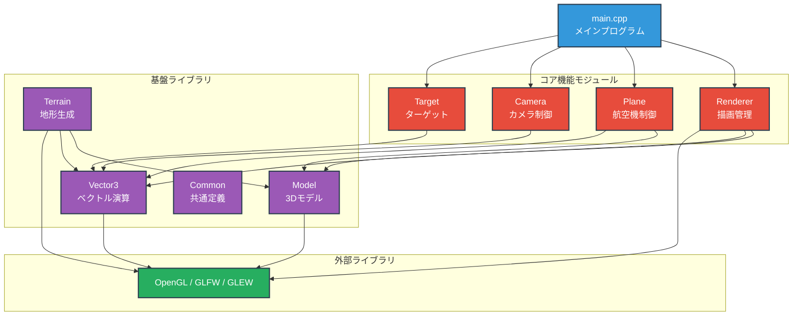

# C++版FlightSim設計仕様書

## 1. 概要

### 1.1 プロジェクト概要
本プロジェクトは、OpenGLとGLFWを使用したC++製の3Dフライトシミュレータです。マウス操作で航空機を操縦し、空中に配置されたターゲットを収集するゲームです。

### 1.2 開発環境
- **言語**: C++（C++11以降）
- **グラフィックライブラリ**: OpenGL 3.3+
- **ウィンドウ管理**: GLFW 3.x
- **拡張ライブラリ**: GLEW（OpenGL Extension Wrangler）

### 1.3 主要機能
- リアルタイム3D描画
- 物理ベースの飛行シミュレーション
- マウスによる直感的な操縦
- 飛行軌跡の可視化
- レーダー表示
- Seuss風の地形生成

---

## 2. システム構成

## 2.1 モジュール構成図



### 凡例

| 色 | 分類 | 説明 |
|---|------|------|
| 🔵 青色 | メインプログラム | ゲームループと全体制御 |
| 🔴 赤色 | コア機能モジュール | ゲームロジックと描画を担当 |
| 🟣 紫色 | 基盤ライブラリ | データ構造と数学演算 |
| 🟢 緑色 | 外部ライブラリ | OpenGL描画基盤 |

### モジュール間の依存関係

- **main.cpp** がすべてのコア機能モジュールを統合
- **コア機能モジュール** が基盤ライブラリを使用
- **基盤ライブラリ** がOpenGLを直接利用

この構成により、各モジュールの責務が明確に分離され、保守性の高い設計となっています。

### 2.2 ファイル構成

| ファイル名 | 役割 | 主要クラス/関数 |
|-----------|------|----------------|
| **common.h** | 定数定義・色定義・数学ユーティリティ | Config, Color3f, MathUtil |
| **vector3.h** | 3Dベクトル演算 | Vec3f |
| **model.h** | 3Dモデルデータ構造 | Model, Triangle |
| **plane.h/cpp** | 航空機の物理演算と描画 | Plane |
| **target.h/cpp** | ターゲットオブジェクト | Target |
| **camera.h/cpp** | カメラ制御と追従 | Camera |
| **terrain.h/cpp** | 地形生成 | TerrainGenerator |
| **renderer.h/cpp** | OpenGL描画管理 | Renderer |
| **main.cpp** | メインループとゲームロジック | main, updateGame |

---

## 3. 詳細設計

### 3.1 座標系

本シミュレータは**右手座標系**を採用：
- **X軸**: 右方向が正（+X）
- **Y軸**: 上方向が正（+Y）
- **Z軸**: 手前方向が正（+Z）、奥方向が負（-Z）

### 3.2 角度定義

- **Heading（方位角）**: Y軸周りの回転、0度が画面奥方向（-Z方向）
- **Pitch（ピッチ）**: X軸周りの回転、正で機首上げ
- **Roll（ロール）**: Z軸周りの回転、正で右傾き

---

## 4. 飛行パラメータ調整ガイド

### 4.1 飛行スピードの調整

#### 📍 調整箇所1: 速度範囲の設定
**ファイル**: `common.h`  
**場所**: `namespace Config` 内

```cpp
constexpr float MIN_SPEED = 5.0f;   // 最低速度
constexpr float MAX_SPEED = 50.0f;  // 最高速度
```

**調整指針**:
- `MIN_SPEED`: 失速速度。小さすぎると操縦困難、大きすぎると緩慢
- `MAX_SPEED`: 最高速度。大きいほどスリリング、小さいほど安定
- **推奨範囲**: MIN 5～20、MAX 30～100

#### 📍 調整箇所2: 加速レート
**ファイル**: `common.h`  
**場所**: `namespace Config` 内

```cpp
constexpr float ACCELERATION_RATE = 1.0f;  // 加速度
```

**調整指針**:
- 値を大きくすると急加速・急減速
- 値を小さくすると緩やかな加速
- **推奨範囲**: 0.5～2.0

#### 📍 調整箇所3: 速度更新ロジック
**ファイル**: `plane.cpp`  
**関数**: `Plane::updatePhysics(float deltaTime)`

```cpp
// エネルギー保存を考慮した速度更新
static float prevAltitude = pos.y;
float deltaAltitude = pos.y - prevAltitude;

const float g = 9.8f;
float energyChange = -deltaAltitude * g * 0.1f;  // ★ここを調整

velocity += accelerationRate * deltaTime;
velocity += energyChange;
velocity = MathUtil::clamp(velocity, minSpeed, maxSpeed);
```

**調整パラメータ**:
- `g * 0.1f` の `0.1f`: 高度変化の速度への影響度
  - 大きくすると上昇で減速、下降で加速が顕著
  - 小さくするとエネルギー保存の影響が小さくなる
  - **推奨範囲**: 0.05～0.2

#### 📍 調整箇所4: 移動速度の実効率
**ファイル**: `plane.cpp`  
**関数**: `Plane::updatePhysics(float deltaTime)`

```cpp
// 位置更新
pos.x += vx * deltaTime * 0.5f;  // ★係数を調整
pos.y += vy * deltaTime * 0.5f;  // ★係数を調整
pos.z += vz * deltaTime * 0.5f;  // ★係数を調整
```

**調整指針**:
- 係数を大きくすると実効速度が上がる
- 係数を小さくすると実効速度が下がる
- **推奨範囲**: 0.3～1.0

---

### 4.2 飛行軌跡の調整

#### 📍 調整箇所1: 軌跡の点数と間隔
**ファイル**: `common.h`  
**場所**: `namespace Config` 内

```cpp
constexpr int MAX_TRAIL_POINTS = 50;      // 軌跡の最大点数
constexpr float TRAIL_INTERVAL = 0.1f;    // 軌跡記録間隔（秒）
```

**調整指針**:
- `MAX_TRAIL_POINTS`: 大きいほど長い軌跡
  - **推奨範囲**: 20～100
- `TRAIL_INTERVAL`: 小さいほど密な軌跡
  - **推奨範囲**: 0.05～0.5秒

#### 📍 調整箇所2: 軌跡の放出位置
**ファイル**: `plane.cpp`  
**関数**: `Plane::getTailPosition() const`

```cpp
Vec3f Plane::getTailPosition() const {
    if (!visualModel || visualModel->verts.empty()) {
        return pos;
    }
    
    // 垂直尾翼の頂点（v3）のローカル座標
    Vec3f tailLocal = visualModel->verts[3];  // ★ここを変更
    
    // 回転を適用してワールド座標に変換
    // ...
}
```

**調整指針**:
- `verts[3]` を他の頂点インデックスに変更すると放出位置が変わる
- 完全に機体中心から放出したい場合: `Vec3f tailLocal(0, 0, 0);`

#### 📍 調整箇所3: 軌跡の描画スタイル
**ファイル**: `renderer.cpp`  
**関数**: `Renderer::drawTrail()`

```cpp
void Renderer::drawTrail(const std::vector<std::pair<float, Vec3f>>& trailPoints) const {
    if (trailPoints.empty()) return;
    
    glColor3f(0.0f, 0.0f, 0.0f);  // ★色を変更
    glBegin(GL_POINTS);           // ★描画モードを変更可能
    for (const auto& point : trailPoints) {
        const Vec3f& pos = point.second;
        glVertex3f(pos.x, pos.y, pos.z);
    }
    glEnd();
}
```

**カスタマイズ例**:
```cpp
// 線で描画する場合
glLineWidth(2.0f);
glBegin(GL_LINE_STRIP);
for (const auto& point : trailPoints) {
    glVertex3f(point.second.x, point.second.y, point.second.z);
}
glEnd();

// 色をグラデーションにする場合
for (size_t i = 0; i < trailPoints.size(); ++i) {
    float alpha = static_cast<float>(i) / trailPoints.size();
    glColor4f(0.0f, 0.0f, 0.0f, alpha);  // 徐々に濃く
    glVertex3f(trailPoints[i].second.x, ...);
}
```

---

### 4.3 機体姿勢の調整

#### 📍 調整箇所1: ロール・ピッチの反応速度
**ファイル**: `common.h`  
**場所**: `namespace Config` 内

```cpp
constexpr float BANK_RATE = 0.5f;   // ロール速度（左右傾き）
constexpr float RISE_RATE = 0.8f;   // ピッチ速度（上下）
```

**調整指針**:
- `BANK_RATE`: 大きいほど急旋回
  - **推奨範囲**: 0.3～1.5
- `RISE_RATE`: 大きいほど急上昇・急降下
  - **推奨範囲**: 0.5～2.0

#### 📍 調整箇所2: マウス入力の感度
**ファイル**: `plane.cpp`  
**関数**: `Plane::steer(float normalizedX, float normalizedY)`

```cpp
void Plane::steer(float normalizedX, float normalizedY) {
    float steerX = (normalizedX - 0.5f) * 2.0f;  // ★係数を変更可能
    float steerY = (normalizedY - 0.5f) * 2.0f;  // ★係数を変更可能
    
    bankRate = steerX * 90.0f;        // ★最大ロール角を変更
    riseRate = -steerY * 80.0f;       // ★最大ピッチレートを変更
    accelerationRate = -steerY * 20.0f; // ★加速度を変更
}
```

**調整指針**:
- `* 90.0f`: 最大ロール角度（度/秒）
  - 大きいほど急旋回、**推奨範囲**: 60～120
- `* 80.0f`: 最大ピッチレート（度/秒）
  - 大きいほど急上昇/降下、**推奨範囲**: 50～100
- `* 20.0f`: 加速度の変化レート
  - 大きいほどスロットル操作が敏感、**推奨範囲**: 10～40

#### 📍 調整箇所3: 姿勢の安定性（減衰）
**ファイル**: `plane.cpp`  
**関数**: `Plane::updatePhysics(float deltaTime)`

```cpp
// ロールの減衰（自然に水平に戻る）
float rollDamping = 0.97f;  // ★ロール減衰係数
roll *= rollDamping;

// ピッチの減衰（自然に水平に戻る）
float pitchDamping = 0.99f;  // ★ピッチ減衰係数
pitch *= pitchDamping;
```

**調整指針**:
- 減衰係数は 0.0～1.0 の範囲
- **1.0に近い**: 姿勢が保たれやすい（安定）
- **0.0に近い**: すぐに水平に戻る（不安定）
- **推奨範囲**: 
  - Roll: 0.95～0.99
  - Pitch: 0.97～0.995

#### 📍 調整箇所4: 姿勢の制限角度
**ファイル**: `plane.cpp`  
**関数**: `Plane::updatePhysics(float deltaTime)`

```cpp
roll = MathUtil::clamp(roll, -60.0f, 60.0f);   // ★最大ロール角
pitch = MathUtil::clamp(pitch, -60.0f, 60.0f); // ★最大ピッチ角
```

**調整指針**:
- 値を大きくすると大胆な機動が可能
- 値を小さくすると安定した飛行
- **推奨範囲**: 
  - Roll: 45～90度
  - Pitch: 45～80度

#### 📍 調整箇所5: 旋回レート
**ファイル**: `plane.cpp`  
**関数**: `Plane::updatePhysics(float deltaTime)`

```cpp
// 旋回：ロールに応じて方位角を変更
float turnRate = -roll * 0.5f;  // ★旋回係数
heading += turnRate * deltaTime;
```

**調整指針**:
- 係数を大きくすると小さなロールで大きく旋回
- 係数を小さくすると大きなロールが必要
- **推奨範囲**: 0.3～1.0

---

### 4.4 機体モデルの形状調整

#### 📍 調整箇所: 機体の頂点定義
**ファイル**: `plane.cpp`  
**関数**: `Plane::createPlaneModel()`

```cpp
void Plane::createPlaneModel() {
    visualModel = std::make_unique<Model>();
    
    float scale = 5.0f;  // ★全体サイズを調整
    
    // 頂点定義
    int v0 = visualModel->addVertex(Vec3f(0.0f, 0.0f, 3.0f * scale));      // 機首
    int v1 = visualModel->addVertex(Vec3f(-2.0f * scale, 0.0f, -2.0f * scale));  // 左翼
    int v2 = visualModel->addVertex(Vec3f(2.0f * scale, 0.0f, -2.0f * scale));   // 右翼
    int v3 = visualModel->addVertex(Vec3f(0.0f, 0.5f * scale, -1.5f * scale));   // 尾翼
    
    // ...三角形定義...
}
```

**カスタマイズ指針**:
- `scale`: 全体のサイズ倍率（推奨: 3.0～10.0）
- 各頂点の座標を変更して機体形状をカスタマイズ可能
- 頂点を追加して複雑な形状も作成可能

**形状変更例**:
```cpp
// より細長い機体
int v0 = visualModel->addVertex(Vec3f(0.0f, 0.0f, 4.0f * scale));  // 機首を伸ばす

// より幅広い翼
int v1 = visualModel->addVertex(Vec3f(-3.0f * scale, 0.0f, -2.0f * scale));
int v2 = visualModel->addVertex(Vec3f(3.0f * scale, 0.0f, -2.0f * scale));

// より高い垂直尾翼
int v3 = visualModel->addVertex(Vec3f(0.0f, 1.0f * scale, -1.5f * scale));
```

---

## 5. カメラ調整ガイド

### 5.1 カメラ追従パラメータ

#### 📍 調整箇所1: カメラ距離と高さ
**ファイル**: `common.h`

```cpp
constexpr float CAMERA_LAG_DISTANCE = 50.0f;  // 機体からの距離
constexpr float CAMERA_LAG_TIME = 0.1f;       // 追従の遅延時間
```

**ファイル**: `camera.cpp`  
**関数**: `Camera::update()`

```cpp
// カメラの理想位置（飛行機の後方50、上方15）
Vec3f idealPos = planePos + backward.mul(50.0f) + Vec3f(0.0f, 15.0f, 0.0f);
                                      // ★距離  ★高さ
```

**調整指針**:
- **後方距離（50.0f）**: 大きいほど引きの画角
  - 推奨範囲: 30～100
- **上方オフセット（15.0f）**: 大きいほど俯瞰視点
  - 推奨範囲: 5～30
- **LAG_TIME**: 小さいほど追従が速い
  - 推奨範囲: 0.05～0.3秒

#### 📍 調整箇所2: 視野角（FOV）
**ファイル**: `common.h`

```cpp
constexpr float FOV = 60.0f;  // 視野角（度）
```

**調整指針**:
- 小さい値（30～50）: 望遠レンズ的、遠くが見やすい
- 大きい値（70～90）: 広角レンズ的、視界が広い
- **推奨範囲**: 45～75度

---

## 6. パフォーマンス調整

### 6.1 描画最適化

#### 📍 調整箇所: 描画距離
**ファイル**: `common.h`

```cpp
constexpr float NEAR_PLANE = 1.0f;    // 最近描画距離
constexpr float FAR_PLANE = 1000.0f;  // 最遠描画距離
```

**調整指針**:
- `FAR_PLANE`を小さくすると遠くの描画を省略してパフォーマンス向上
- **推奨範囲**: 500～2000

### 6.2 地形の複雑度

#### 📍 調整箇所: メサの頂点数
**ファイル**: `terrain.cpp`  
**関数**: `TerrainGenerator::createSeussMesa()`

```cpp
const int numVerts = 36;  // 各リングの頂点数（★調整可能）
```

**調整指針**:
- 小さい値（16～24）: 低負荷だが角ばる
- 大きい値（48～64）: 滑らかだが高負荷
- **推奨範囲**: 24～48

---

## 7. ゲームバランス調整

### 7.1 ターゲット設定

#### 📍 調整箇所: ターゲットサイズ
**ファイル**: `common.h`

```cpp
constexpr float TARGET_SIZE = 10.0f;  // ターゲットの半径
```

**調整指針**:
- 大きいほど簡単、小さいほど難しい
- **推奨範囲**: 5.0～20.0

#### 📍 調整箇所: ターゲット配置
**ファイル**: `main.cpp`

```cpp
std::vector<Vec3f> targetPositions = {
    Vec3f(30.0f, 70.0f, 20.0f),   // X, Y, Z座標
    Vec3f(100.0f, 80.0f, 80.0f),
    // ...
};
```

**調整指針**:
- Y座標（高度）: 50～150が適切
- 距離: 原点から50～200が適切

---

## 8. デバッグ機能

### 8.1 デバッグ出力

各所に以下のようなデバッグ出力を追加可能：

```cpp
// plane.cpp の updatePhysics() 内
std::cout << "Pos: " << pos << " Vel: " << velocity 
          << " Heading: " << heading << std::endl;
```

### 8.2 ビジュアルデバッグ

機体の向きを示す緑の線（現在はコメントアウト）：

```cpp
// plane.cpp の draw() 内（再有効化する場合）
glDisable(GL_DEPTH_TEST);
glLineWidth(3.0f);
glBegin(GL_LINES);
glColor3f(0.0f, 1.0f, 0.0f);
glVertex3f(0.0f, 0.0f, 0.0f);
glVertex3f(0.0f, 0.0f, 30.0f);  // Z軸方向に線を描画
glEnd();
glEnable(GL_DEPTH_TEST);
```

---

## 9. よくある調整シナリオ

### 9.1 「もっと速く飛びたい」

1. `common.h` の `MAX_SPEED` を 100.0f に変更
2. `plane.cpp` の移動係数を 0.5f → 0.8f に変更
3. `ACCELERATION_RATE` を 1.5f に変更

### 9.2 「もっと機敏に操縦したい」

1. `BANK_RATE` を 1.0f に変更
2. `RISE_RATE` を 1.2f に変更
3. `steer()` 内の `* 90.0f` を `* 120.0f` に変更

### 9.3 「より安定した飛行にしたい」

1. `rollDamping` を 0.95f に変更（より速く水平に戻る）
2. `pitchDamping` を 0.97f に変更
3. `roll` と `pitch` の制限角度を ±45度に変更

### 9.4 「軌跡をもっと長く残したい」

1. `MAX_TRAIL_POINTS` を 100 に変更
2. `TRAIL_INTERVAL` を 0.05f に変更（より密に記録）

### 9.5 「カメラをもっと引きにしたい」

1. `camera.cpp` の `backward.mul(50.0f)` を `80.0f` に変更
2. `FOV` を 70.0f に変更（広角に）

---

## 10. ビルド方法

### 10.1 必要なライブラリ

```bash
# Ubuntu/Debian
sudo apt-get install libglfw3-dev libglew-dev

# macOS (Homebrew)
brew install glfw glew

# Windows
# GLFW と GLEW を公式サイトからダウンロード
```

### 10.2 コンパイルコマンド例

```bash
# GCC/Clang
g++ -std=c++11 \
    main.cpp plane.cpp target.cpp camera.cpp \
    terrain.cpp renderer.cpp \
    -lGL -lGLEW -lglfw -lGLU \
    -o FlightSim

# 実行
./FlightSim
```

### 10.3 CMakeLists.txt例

```cmake
cmake_minimum_required(VERSION 3.10)
project(FlightSimulator)

set(CMAKE_CXX_STANDARD 11)

find_package(OpenGL REQUIRED)
find_package(GLEW REQUIRED)
find_package(glfw3 REQUIRED)

add_executable(FlightSim
    main.cpp
    plane.cpp
    target.cpp
    camera.cpp
    terrain.cpp
    renderer.cpp
)

target_link_libraries(FlightSim
    OpenGL::GL
    OpenGL::GLU
    GLEW::GLEW
    glfw
)
```

---

## 11. 今後の拡張案

- [ ] サウンド効果の追加
- [ ] 複数の機体モデル選択
- [ ] 天候・時間帯の変化
- [ ] 物理演算の高度化（風、乱気流）
- [ ] マルチプレイヤー対応
- [ ] スコアシステムとリーダーボード

---

## 付録A: 主要定数一覧表

| 定数名 | デフォルト値 | 説明 | 調整範囲 |
|-------|------------|------|---------|
| `MIN_SPEED` | 5.0f | 最低速度 | 5～20 |
| `MAX_SPEED` | 50.0f | 最高速度 | 30～100 |
| `BANK_RATE` | 0.5f | ロール速度 | 0.3～1.5 |
| `RISE_RATE` | 0.8f | ピッチ速度 | 0.5～2.0 |
| `ACCELERATION_RATE` | 1.0f | 加速度 | 0.5～2.0 |
| `MAX_TRAIL_POINTS` | 50 | 軌跡点数 | 20～100 |
| `TRAIL_INTERVAL` | 0.1f | 軌跡間隔 | 0.05～0.5 |
| `CAMERA_LAG_DISTANCE` | 50.0f | カメラ距離 | 30～100 |
| `FOV` | 60.0f | 視野角 | 45～75 |
| `TARGET_SIZE` | 10.0f | ターゲット半径 | 5～20 |

---

## 付録B: トラブルシューティング

### 問題: 機体が見えない
- **原因**: カメラが機体内部にいる
- **解決**: `CAMERA_LAG_DISTANCE` を大きくする

### 問題: 動きが遅い/速すぎる
- **原因**: フレームレートの影響
- **解決**: `deltaTime` の使い方を確認、VSync確認

### 問題: 軌跡が表示されない
- **原因**: 点が小さすぎる
- **解決**: `renderer.cpp` で `glPointSize(5.0f)` を設定

### 問題: 地形が表示されない
- **原因**: カリングで裏面が見えている
- **解決**: `glDisable(GL_CULL_FACE)` でカリング無効化

---
