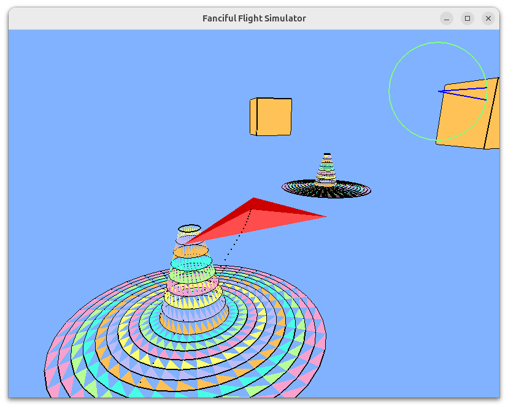

This is a C++ rewrite of FlightSim.  
Since it's no longer tied to Python, it doesn't need PyOpenGL support!  
It gives you a bit more freedom.  

The actual work was done by AI.　　
Design and implementation: Claude 4.5 Sonnet　　
Debugging: GPT-5 Thinking　　
　　
# Library Installation:

## On Linux:
```bash
sudo apt install libglfw3-dev libglew-dev libglu1-mesa-dev freeglut3-dev
```
## On Windows:

On Windows, use w64devkit.
w64devkit is located in C:\w64devkit.

#### 1. Installing GLFW3

1. Download the latest `glfw-3.x.x.bin.WIN64.zip` from https://github.com/glfw/glfw/releases
2. After extraction:

- `include/GLFW/*` → `C:\w64devkit\x86_64-w64-mingw32\include\GLFW\`

- `lib-mingw-w64/*.a` → `C:\w64devkit\x86_64-w64-mingw32\lib\`

- `lib-mingw-w64/*.dll` → `C:\w64devkit\bin\`

#### 2. Installing GLEW

1. Download `glew-x.x.x-win32.zip` from https://github.com/nigels-com/glew/releases
2. After unzipping:
- `include/GL/*` → `C:\w64devkit\x86_64-w64-mingw32\include\GL\`
- Rename `lib/Release/x64/glew32.lib` to `glew32.a` → `C:\w64devkit\x86_64-w64-mingw32\lib\`
- `bin/Release/x64/glew32.dll` → `C:\w64devkit\bin\`

**Alternatively, use the MinGW binary:**
```bash
# Convert lib files to a files (if necessary)
cd /c/w64devkit/x86_64-w64-mingw32/lib
# If an .a file already exists, you can use it as is
```

#### 3. Installing GLM (Header Only)

1. Download the latest `.zip` from https://github.com/g-truc/glm/releases
2. After extraction:
- `glm/glm/*` → `C:\w64devkit\x86_64-w64-mingw32\include\glm\`


